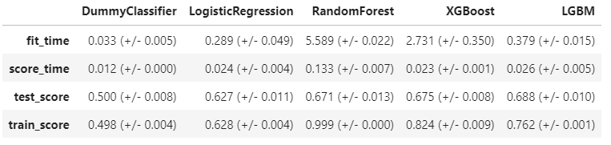

# Credit Card Customer Default
This repo hosts a Machine Learning pipeline for analysis of credit card customer default.

For more details, please refer to the [Kaggle Kernel](https://www.kaggle.com/arashshamseddini/kaggle-customer-default/).

In this analysis, a classification problem of predicting whether a credit card client will default or not is addressed.

## Dataset
The dataset in this study is the [Default of Credit Card Clients Dataset](https://www.kaggle.com/uciml/default-of-credit-card-clients-dataset) in which there are 30,000 examples and 24 features, and the goal is to estimate whether a person will default (fail to pay) their credit card bills; this column is labeled `default.payment.next.month` in the data.

Below is a sneak peek at the dataset.

## Modeling
In this work, the following classifiers have been used and the final [f1](https://en.wikipedia.org/wiki/F-score) scores are compared as follows. 

- Baseline Classifier ([DummyClassifier](https://scikit-learn.org/stable/modules/generated/sklearn.dummy.DummyClassifier.html))

- [LogisticRegression](https://scikit-learn.org/stable/modules/generated/sklearn.linear_model.LogisticRegression.html) (Don't fall for the name, this is a classifier not a regressor)

- [RandomForest Classifier](https://scikit-learn.org/stable/modules/generated/sklearn.ensemble.RandomForestClassifier.html)

- [XGBoost](https://xgboost.readthedocs.io/en/latest/)

- [LightGBM](https://lightgbm.readthedocs.io/en/latest/)

## [Feature Selection](https://en.wikipedia.org/wiki/Feature_selection)
Feature Selection is carried out on the models to check if it would improve the performance. However, based on the results, the improvement is not significant and since there are not too many features in this example, it is safe to be removed from the pipeline.

## [Hyperparameter Optimization](https://en.wikipedia.org/wiki/Hyperparameter_optimization)
Attempt has been made to optimize the three classifiers. Based on below results, Hyperparameter Optimization seems to help with **RandomForest** and a little with **LightGBM** but not **XGBoost**. Although **RandomForest** scores are a little better, here we pick **LightGBM** for the remainder of the work because it is much faster. 

Of course, since this is more like an open ended study, there is the chance that given a deeper dive into hyperparameter optimization, better scores from the models would not be far from reach. However, this is not the main focus of this work.

## Interpretation & Feature Importances
In this section of the analysis, we would like to answer the following question:

**Which features have the most and the least impact on the target?**
First of all, we will be continuing with optimized `LightGBM` as one of the best performing model. Second, we will use the [SHAP](https://github.com/slundberg/shap) approach to explain the importance of each feature. In other words:

- How small or big a feature can affect the target

- The direction towards which the feature pushes the target (class `0` or class `1`)

Technically SHAP uses the encoded features. Therefore, it would help to take a look at these features.

Below table shows the calculated SHAP coefficients for these encoded features.

The results can further be explained by **SHAP Dependence** plot as well as **SHAP Summary** plot.

**SHAP Dependence Plot**
As an example for one of the features, `BILL_AMT1`:

The plot above shows the effect of `LIMIT_BAL` feature on the prediction. Here, the x-axis represents values of the feature `LIMIT_BAL` and the y-axis is the `SHAP` value for that feature, which represents how much knowing that feature's value changes the output. Obviously, higher values of `LIMIT_BAL` result in higher `SHAP` values for class "0" of the target. This suggests that class is likely to be "0" (`non-default`) with higher values for `LIMIT_BAL` which makes sense.  Also, the color corresponds to a second feature (`BILL_AMT2`) that may have an interaction effect with `LIMIT_BAL`.

**SHAP Summary Plot**

The plot shows the most important features for predicting the class. It also shows the direction of how it is going to drive the prediction. Higher `SHAP` value means positive association with class "0" of the target as we are using `SHAP` values for class "0". As an example, higher value of `BILL_AMT1` feature has a high negative impact on the prediction of the target as class "0", or higher value of `LIMIT_BAL` feature has a high positive impact on the prediction of the target as class "0".

## Results on the Test Set
Using optimized `LightGBM` as the best performing model, we can score the model on the test set and get the pertinent scores.

The overall summary of the models' scores are indicated in the following diagram.

## Conclusions
Since the project is open-ended, there is still room for improvement. We can go much deeper in `Preprocessing`, `Feature Selection`, `Feature Engineering` and `Hyperparameter Optimization`. We can also investigate the performance of other classifiers as well and even make attempts to tune them to get better validation scores. We can summarize the concluding remarks as below:
- As expected `DummyClassifier` has the lowest performance compared to other models and the fact that we have class imbalance within the target makes the results from `DummyClassifier` even more unreliable.
- For our case, a linear model like `LogisticRegression` has an average performance where tree_based models have better performance compared with `LogisticRegression`, among which `LightGBM` has the best performance.
- For the case under study, the performed feature selection with `REFCV` did not improve the scores. Perhaps if enough time is spent on this process, better results are not far from reach.
- Signs of improvement in validation scores are observed with hyperparameter optimization. This is another field which, as mentioned earlier, has the potential to better the scores.
- `LightGBM` classifier, was picked and applied to the test set for which test results agreed well with validation scores and since the dataset is large enough, there is no concern with `optimization bias` for our case.

